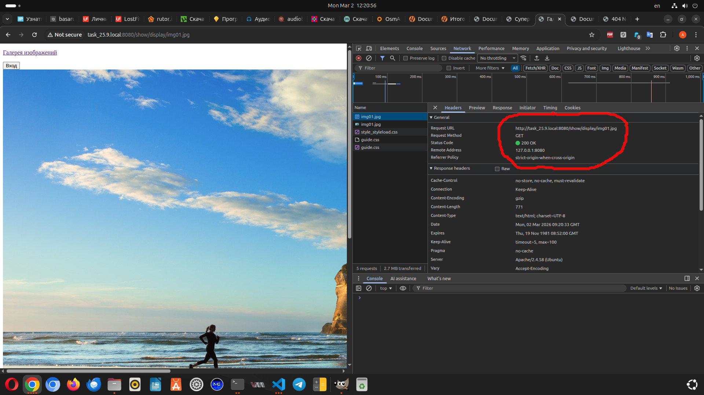
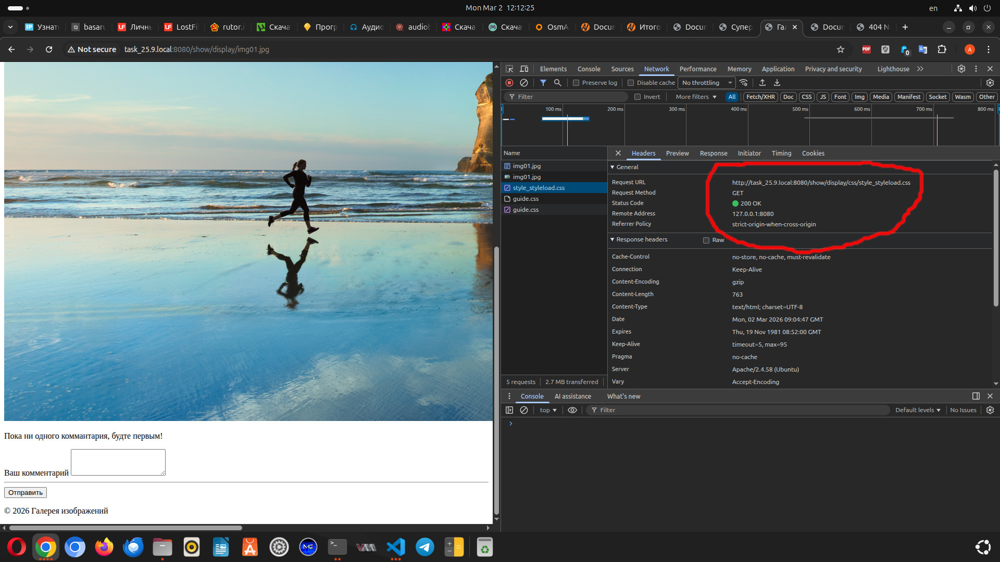
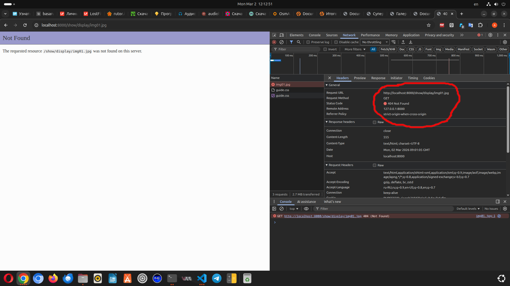
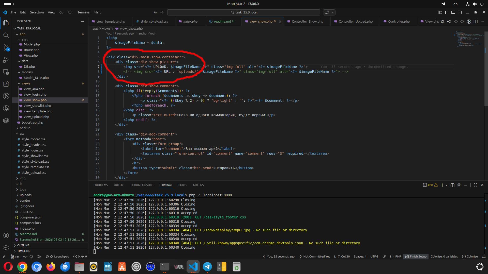
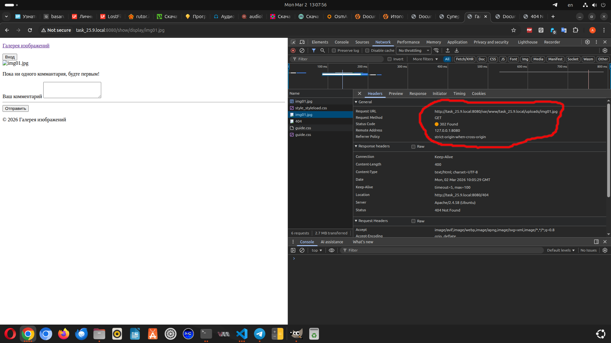

Столкнулся с такой проблеммой:
- Если запускать отдельный веб-сервер под Apache, то при клике на картинке для открытия полного изображния
    происходит переход в соответствии с маршрутом в Controller_Show и открывается страница, подгружается картинка,
    но не загружаются стили URL меняется на http://task_25.9.local:8080/show/display/css/style_styleload.css, хотя
    если переходишь на маршрут login. то все отрабатывает нормально.

- Если запускать встроенный веб-сервер из VisualCode, то маршрут login отрабатывает нормально, а маршрут show/diplay
    вообще не отрабатывается.

- И еще не могу понять почему-то в теге img не получается указать относительный путь, к пути автоматически добавляется URL

